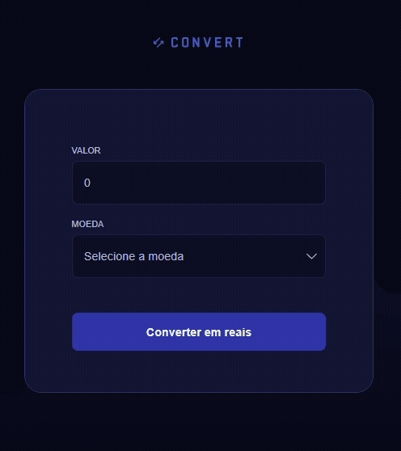

# 💱 Currency Converter
---

## 📌 Sobre o projeto

O **Currency Converter** é uma aplicação web que realiza a conversão de valores entre diferentes moedas (USD, EUR e GBP) para Real (BRL).

Na primeira versão, as taxas de câmbio eram baseadas em valores fixos definidos no código, simulando o comportamento de um sistema de conversão monetária.

Com a evolução do projeto, a aplicação passou a consumir dados reais de uma API de câmbio, tornando a conversão dinâmica e mais próxima de um cenário de produção.

O projeto foi desenvolvido com foco em prática de lógica de programação, manipulação do DOM, integração com APIs e estruturação de aplicações web.

---

## 🌐 Deploy

A aplicação está disponível online:  
👉 https://currency-converter-seven-ruddy.vercel.app/

---

## 📸 Preview

Demonstração do funcionamento da aplicação em tempo real:

  

---

## 🚀 Evolução do Projeto (Integração com API)

Nesta versão, foi implementada a integração com uma API externa de câmbio, permitindo a atualização das taxas em tempo real.

Além disso, foi criada uma camada intermediária utilizando funções serverless no Vercel, responsável por:

- Realizar a comunicação com a API externa  
- Proteger a chave de acesso (API Key) com variáveis de ambiente  
- Processar e retornar apenas os dados necessários para o frontend  

Com isso, o projeto evoluiu de uma aplicação estática para uma aplicação dinâmica, adotando uma arquitetura mais próxima de sistemas reais, com separação entre frontend e backend.

---

## ⚙️ Funcionalidades

- Inserção de valor a ser convertido
- Seleção de moeda (USD, EUR, GBP)
- Conversão automática para Real (BRL)
- Consumo de API externa para taxas atualizadas
- Exibição da taxa utilizada na conversão
- Exibição do valor final formatado em reais
- Validação de entrada numérica
- Interface responsiva e estilizada

---

## ⚠️ Observações

Os valores de câmbio podem apresentar pequenas variações em relação a outras fontes, devido à atualização em tempo real e à diferença entre provedores de dados.

---

## 🧠 Aprendizados

Durante o desenvolvimento deste projeto, foram aplicados conceitos como:

- Manipulação do DOM com JavaScript
- Eventos de formulário (`submit`, `input`)
- Estruturas de controle (`switch`)
- Funções e reutilização de código
- Consumo de APIs com `fetch`
- Tratamento de dados em formato JSON
- Criação de endpoints com funções serverless
- Uso de variáveis de ambiente para segurança de credenciais
- Organização de layout com HTML e CSS

---

## 🛠️ Tecnologias utilizadas

- HTML5
- CSS3
- JavaScript
- Vercel (Serverless Functions)
- API de câmbio (Exchange Rate)
